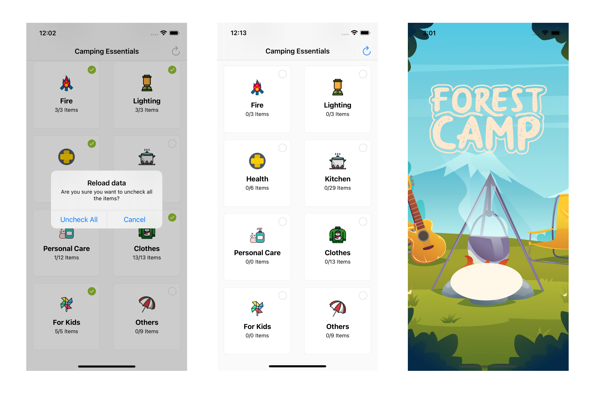

# Forest Camp
## Overview

Forest Camp is an iOS app developed in Objective-C.
This App was made by me to practice learning Objective-C and also for helping me because I really love camping!

Forest Camp helps its users to prepare all the stuff for camping according to the categories: "Sleeping", "Tools", "Fire", "Lighting", "Health", "Kitchen", "Personal Care", "Clothes", "For Kids", "Others".
It will indicate to you how many items you've already prepared and how many are not ready yet. In the future, I'm going to make a feature to add new items into a list and edit existing ones, add more pictures, and maybe ​amazon links to order the items.
The list of items was provided to me by one blogger on Instagram.

## Features
* Objective-C Programming Language
* CoreData, UICollectionView, UICollectionViewCell, UITableView, Structured files


* Checkmarks on the items and categories (category is checked automatically if all items inside it are checked by user)


* Reload data anytime to prepare for new camping, all items will become unchecked.




## How to build
1. Clone the repository
```
$ git clone https://github.com/EllaGlv/forest-camp-objective-c-app.git
```
2. Open the project in Xcode
```
$ open "ForestCamp.xcodeproj"
```
3. Compile and run the app in your simulator or on the device.


## Requirements

- Xcode
- iOS 9.0 +
- Objective-C
